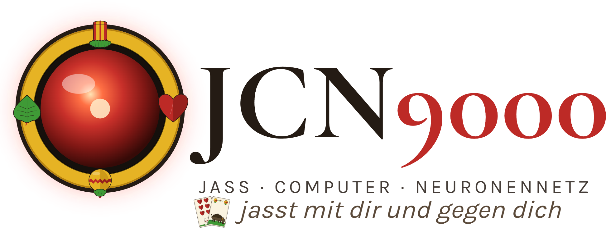
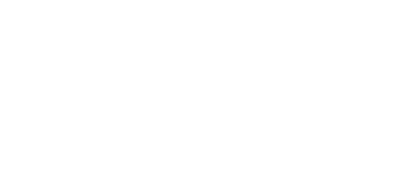
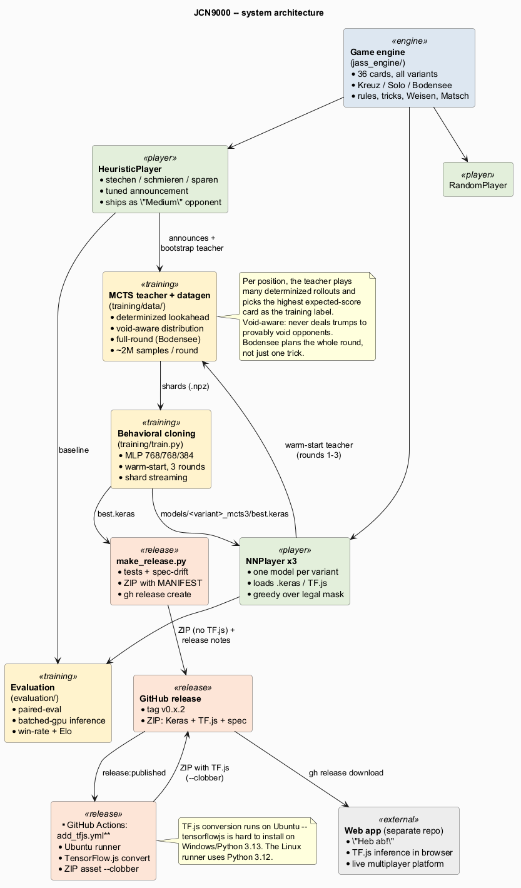

<p align="center">
  <picture>
    <source media="(prefers-color-scheme: dark)" srcset="docs/assets/jcn9000-logo-dark.png">
    
  </picture>
</p>

<p align="center"><strong>JCN9000 — die künstliche Jass-Intelligenz.</strong><br>
Ein neuronales Netz als Karten-KI für den Vorarlberger <em>Jass</em>, in drei Spielarten.</p>

<p align="center"><a href="README.md">English</a> · <strong>Deutsch</strong></p>

<p align="center">
  <a href="LICENSE"></a>
  
  
  
</p>

---

JCN9000 lernt, **Vorarlberger Jass** zu spielen — das alemannische Stich-Kartenspiel —
auf einem Niveau weit jenseits jedes regelbasierten Bots. Trainiert wird in
Python/TensorFlow; ausgeliefert wird ein kompaktes TensorFlow.js-Modell, das im
Browser als KI-Gegner der separaten Web-App *„Heb ab!"* läuft.

Drei Spielarten, je ein eigenes Modell:

- **Kreuz-Jass** — 4 Spieler, zwei Teams über Kreuz.
- **Solo-Jass** — 4 Spieler, jeder für sich.
- **Bodensee-Jass** — 2 Spieler, mit Tisch-Mechanik (Hand + sichtbarer + verdeckter Tisch, 18 Stiche).

## Inhaltsverzeichnis

- [Wie gut spielt es?](#wie-gut-spielt-es)
- [Warum „JCN9000"?](#warum-jcn9000)
- [Was steckt drin](#was-steckt-drin)
- [Wie es lernt](#wie-es-lernt)
- [Architektur](#architektur)
- [Schnellstart](#schnellstart)
- [Web-App-Integration](#web-app-integration)
- [Dokumentation](#dokumentation)
- [Lizenz](#lizenz)

## Wie gut spielt es?

Aktuelle Modelle (Release `v0.7.2` / `v0.8.2` / `v0.9.2`), gemessen mit paired-eval
(gespiegelte Sitze + identische Kartenverteilung, sodass das Karten-Glück
herausfällt):

| Spielart | Modell | vs. Heuristik-Gegner | vs. eigenes Vorgängermodell |
|---|---|---|---|
| Kreuz | [v0.7.2](docs/model_cards/v0.7.2.md) | **83,5 %** | 57,9 % |
| Solo | [v0.8.2](docs/model_cards/v0.8.2.md) | **78,8 %** | 46,8 % (4-Spieler-Tisch) |
| Bodensee | [v0.9.2](docs/model_cards/v0.9.2.md) | **96,8 %** | 92,4 % |

Die Heuristik selbst ist ein starker, handgetunter regelbasierter Spieler — und
JCN9000 schlägt sie in jeder Spielart deutlich. Bei Bodensee ist die Heuristik als
Maßstab praktisch *gesättigt*: Sie verliert fast jede Partie, sodass nur noch
menschliches Spiel ein aussagekräftiger Vergleich ist.

> Alle Zahlen sind ehrliche, reproduzierbare paired-eval-Ergebnisse — die
> Aufschlüsselung pro Variante, Stichprobengrößen und bekannte Schwächen stehen in
> der jeweiligen Modell-Karte.

## Warum „JCN9000"?

In Kubricks *2001: Odyssee im Weltraum* wird der Computer **HAL** gern als **IBM**
gelesen, um einen Buchstaben zurückverschoben (H→I, A→B, L→M). Geht man einen
Schritt weiter nach vorne, landet man bei **JCN** — *Jass Computer Neuronennetz*.
Die `9000` ist die offensichtliche Hommage. Und HALs eigene Auflösung —
*„Heuristically programmed ALgorithmic computer"* — passt unheimlich gut: Dieses
Projekt ist buchstäblich von einer **Heuristik** über eine **algorithmische**
Monte-Carlo-Suche zu einem **neuronalen** Netz gewachsen.

<p align="center">
  <picture>
    <source media="(prefers-color-scheme: dark)" srcset="docs/assets/jcn9000-animation-dark.png">
    
  </picture>
</p>

(Fürs Protokoll: Es ist kein Bot, sondern ein neuronales Netz. Und anders als HAL
spielt es viel lieber Jass, als die Pod-Bay-Türen zu verriegeln.)

## Was steckt drin

| Komponente | Aufgabe |
|---|---|
| **Spielengine** ([`jass_engine/`](jass_engine/)) | 36 Karten, alle Varianten (Trumpf / Gumpf / Oben / Unten / Slalom), Weisen, Stöcke, Matsch, Schieben — regelgetreu, mit eigenem Bodensee-Modul |
| **Heuristik-Bot** ([`players/heuristic_player.py`](players/heuristic_player.py)) | Starker regelbasierter Spieler: Stechen / Schmieren / Sparen + getuntes Ansage-Scoring. Dient als „Medium"-Gegner der App |
| **Trainings-Pipeline** ([`training/`](training/)) | State-Encoder (v3.0.0 = 421-dim, bodensee_1.0.0 = 291-dim), MCTS-augmentierte Datengen, Keras-MLP (768/768/384), Shard-Streaming-Training |
| **MCTS-Lehrer** ([`training/data/`](training/data/)) | Determinisierter Monte-Carlo-Lookahead mit void-aware Kartenverteilung; Full-Round-Lookahead für Bodensee |
| **NN-Player** ([`players/nn_player.py`](players/nn_player.py)) | Lädt ein trainiertes Modell und spielt greedy über die legale Zug-Maske |
| **Evaluation** ([`evaluation/`](evaluation/)) | paired-eval, batched-GPU-Inferenz, Win-Rate pro Variante, Elo |
| **Schnittstellen-Spec** ([`spec/`](spec/)) | Versionierte Regel-JSON + Encoder-Doku + Test-Fixtures — der Vertrag für den TypeScript-Port |
| **Tests** ([`tests/`](tests/)) | 284 grün: Regeln, Weisen, Heuristik, Encoder, Void-Inferenz, Eval, Spec-Konsistenz |

## Wie es lernt

JCN9000 wird per **MCTS-augmentiertem Behavioral Cloning** trainiert, über mehrere
Runden iteriert:

1. **Lehrer.** Für jede Stellung spielt ein determinisierter Monte-Carlo-Lookahead
   viele hypothetische Fortsetzungen durch und wählt die Karte mit dem besten
   erwarteten Ausgang. Hier sitzt das *Denken* — und das ist der teure Teil
   (Stunden GPU-Zeit pro Runde).
2. **Schüler.** Ein kompaktes MLP (~1,25 Mio. Gewichte) lernt, die Wahl des Lehrers
   zu imitieren. Der Schüler generalisiert weit über eine Lookup-Tabelle hinaus —
   er destilliert Millionen such-abgeleiteter Entscheidungen in eine Funktion, die
   in Millisekunden antwortet.
3. **Iterieren.** Jede Runde startet warm vom Vorgängermodell, sodass die Rollouts
   realistischer und die Labels besser werden. Die aktuellen Modelle sind das
   Ergebnis dreier solcher Runden.

Zwei Ideen der letzten Runde sind hervorzuheben, weil sie Fehler beheben, die auch
ein menschlicher Spieler erkennt:

- **Void-aware Determinisierung** (Kreuz/Solo): Der Lehrer „halluziniert" keine
  Trümpfe mehr bei Gegnern, die nachweislich trumpffrei sind — die KI hört auf,
  sinnlos gegen blanke Gegner auszutrumpfen.
- **Full-Round-Lookahead** (Bodensee): Der Lehrer plant jetzt die *ganze*
  Restrunde statt nur einen Stich — das behebt die Endspiel-Kurzsichtigkeit (z. B.
  zuerst eine Schrott-Karte abwerfen und *dann* den letzten Stich für den
  +5-Bonus holen).

## Architektur



Ausführlich mit beiden Diagrammen: **[Architektur](docs/architecture.de.md)**
(Quellen in [`docs/diagrams/`](docs/diagrams/)). Kurz: Die Python-Engine speist die
Heuristik und den MCTS-Lehrer, die Trainings-Shards erzeugen; Keras trainiert das
MLP; das Modell wird nach TensorFlow.js exportiert und als GitHub-Release-Asset
veröffentlicht, das die Web-App lädt.

## Schnellstart

```bash
git clone https://github.com/matthili/JCN9000.git
cd JCN9000
python -m venv .venv && source .venv/bin/activate   # Windows: .venv\Scripts\activate
pip install -e ".[dev]"            # Engine + Tools (ohne TensorFlow)
pip install -e ".[dev,training]"   # plus TensorFlow für Training / Inferenz
```

```bash
python -m visualization.terminal              # eine komplette Partie im Terminal mitlesen
python -m evaluation.compare_players --games 500   # Heuristik vs. Random als Sanity-Check
streamlit run visualization/streamlit_app.py  # interaktiver Regelprüfer
pytest -q                                     # 284 Tests
```

Trainings- und Eval-Kommandos pro Spielart stehen in den Modell-Karten und im
[Trainings-Runbook](docs/training_runbook_mcts3.md). Die Modelle wurden auf einer
RTX 3060 (12 GB) trainiert.

## Web-App-Integration

Das trainierte Modell wird als TensorFlow.js-Bundle im jeweiligen
GitHub-Release-ZIP ausgeliefert, zusammen mit Regel-Spec und Encoder-Fixtures:

```bash
gh release download v0.9.2 --repo matthili/JCN9000 --pattern "jass-nn-*.zip"
```

- **Encoder-Versionen:** `3.0.0` (Kreuz/Solo, 421-dim) und `bodensee_1.0.0`
  (Bodensee, 291-dim). Die Web-App lädt anhand des `team_mode`-Felds in
  `MANIFEST.json` das zur Spielart passende Modell.
- **Modell-API:** `{state, mask}` → `{policy, value}`. Ansage und Weisen übernimmt
  die Heuristik, nicht das NN.
- Integrations-Briefings pro Release für das App-Team liegen unter
  `docs/web_app_update_v*.md`.

## Dokumentation

- [Architektur](docs/architecture.de.md) — Komponenten, Datenfluss, Diagramme
- [Modell-Karten](docs/model_cards/) — eine pro Release: Daten, Training, Eval, Schwächen
- [Regeln](docs/regeln.md) und [Glossar](docs/glossar.md) — Vorarlberger Jass im Detail
- [Trainings-Runbook](docs/training_runbook_mcts3.md) — die schrittweise Rezeptur
- [Changelog](CHANGELOG.md)

## Lizenz

[AGPL-3.0-or-later](LICENSE) mit Attributions-Zusatz nach §7(b). Kommerzielle
Nutzung ist erlaubt; Weiterentwicklungen — auch im Netzwerkbetrieb — müssen unter
der AGPL offengelegt werden und den Ursprung nennen. Die Klausel gilt auch für die
Modellgewichte. Der Autor betreibt die separate Web-App „Heb ab!" unter eigenen
Rechten.
