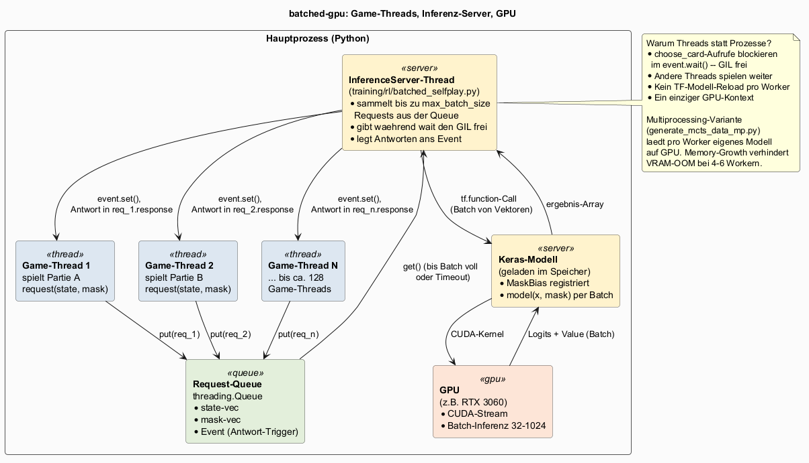

# Architektur-Diagramme

PlantUML-Quellen fuer die wichtigsten Architektur-Diagramme. Pro `.puml`-Datei
liegt nach dem Rendern ein gleichnamiges `.png` daneben.

## Rendern

Java + `plantuml.jar` (hier unter `C:\Tools\PlantUML\`), im Repo-Root:

```bash
# Alle auf einmal
java -DPLANTUML_LIMIT_SIZE=16384 -jar plantuml.jar -tpng docs/diagrams/*.puml

# Einzeln
java -DPLANTUML_LIMIT_SIZE=16384 -jar plantuml.jar -tpng docs/diagrams/system_overview.puml
```

Das `-DPLANTUML_LIMIT_SIZE=16384` hebt die Standard-Bildgroessengrenze an, damit
groessere Diagramme nicht abgeschnitten werden. Ein Pre-Commit-Hook
([`scripts/git-hooks/pre-commit`](../../scripts/git-hooks/pre-commit)) rendert
geaenderte `.puml` automatisch mit.

## Inhalt

### System-Architektur

Gesamt-Architektur vom Code im NN-Repo bis zur Web-App im Browser. Engine, Spieler-Typen, Datengen, Training, Eval, Release-Pipeline.

Quelle: [`system_overview.puml`](system_overview.puml)


### Inferenz-Server (batched-gpu)

Wie der `batched-gpu`-Modus (im Eval und in der MCTS-Datengen) viele parallele Spiele auf eine GPU buendelt. Game-Threads, Queue, Inferenz-Server.

Quelle: [`inference_server.puml`](inference_server.puml)



## Wann ein neues Diagramm dazukommt

Wenn eine Architektur-Entscheidung getroffen wird, die ohne Bild schwer zu
erklaeren ist (z.B. spaeter ein AlphaZero-Stil MCTS-bei-Inferenz oder ein
Continuous-Learning-Loop), gehoert sie hier hinein. Pro Diagramm eine `.puml`
mit kurzem Kommentar oben, was es zeigt und wie es gerendert wird.
